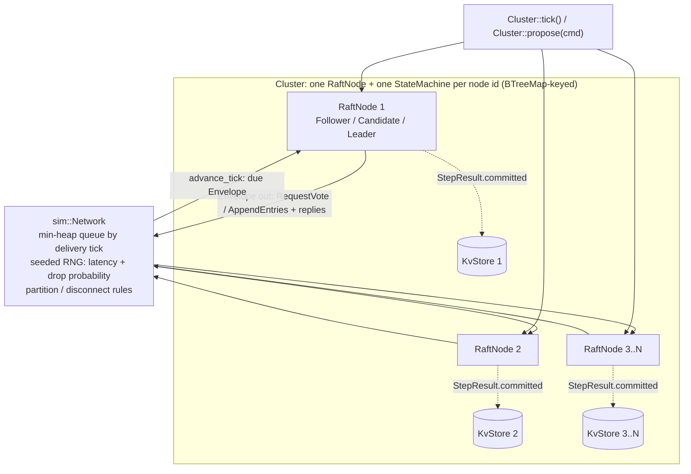

# Raft-Consensus

[](https://github.com/sfeirc/Raft-Consensus/actions/workflows/ci.yml)
[](https://www.rust-lang.org/)
[](LICENSE)

A from-scratch implementation of the **Raft distributed consensus algorithm**
(Ongaro & Ousterhout, *In Search of an Understandable Consensus Algorithm*,
2014) in Rust: leader election, log replication, and the safety rule that
makes committed entries durable across leader changes — with a replicated
key-value store on top to prove it, a deterministic in-memory network
simulator to test it, and a correctness test suite that actually exercises
leader crashes, network partitions, and successive leader changes rather than
just checking that the code doesn't panic.

## Why this exists

Raft is the consensus algorithm behind etcd (and therefore Kubernetes),
Consul, CockroachDB, TiKV, and a good chunk of the "boring, reliable"
distributed-systems infrastructure everyone else builds on. It's also the
canonical systems-design interview topic for exactly that reason: it's simple
enough to explain on a whiteboard in ten minutes and subtle enough that a
naive implementation is *almost always* unsafe in a way that only shows up
under leader failure or network partition. This repo is the "build the whole
thing and prove the subtle part is actually correct" version of that
whiteboard sketch — companion to [`CRDT-DigitalTwin-Store`](https://github.com/sfeirc/CRDT-DigitalTwin-Store)
(replication via commutative merge, no coordinator) and [`ICS-Modbus-IDS`](https://github.com/sfeirc/ICS-Modbus-IDS)
in a small portfolio of systems-level work.

### Why this matters across industries

Strip away the specific systems named above and what's left is a general
problem: how a handful of independent machines agree on a single ordered
history of events when any one of them can crash or get cut off from the
network, without ever disagreeing about what actually happened. That shape
of problem — not this specific codebase, but the mechanism it implements —
shows up anywhere a system has to keep working, consistently, when a
component fails: a trading or order-management system that must fail over
to a backup node without either losing an acknowledged order or replaying
it twice (finance); any replicated backend service that claims to survive a
node dying, which is most of what "highly available infrastructure" means
in practice (tech); and industrial control setups where multiple redundant
controllers must agree on which one is authoritative after a fault — the
same agreement problem, just with programmable logic controllers standing
in for database replicas (industrial/OT). This repository doesn't claim to
run in any of those settings — it's a from-scratch implementation of the
algorithm plus a test suite that adversarially exercises exactly the
failure modes (leader crash, network partition, repeated leader turnover)
that make "agreement under failure" hard in the first place.

## What this actually implements

- **Leader election** (§5.2): randomized election timeouts, `RequestVote`
  RPCs, majority-vote leadership, terms as a logical clock, and the
  "up-to-date log" check that gates who's even eligible to become leader
  (§5.4.1).
- **Log replication** (§5.3): `AppendEntries` RPCs, the log-matching
  property, conflict detection + truncation on followers, and the
  fast-backtrack optimization (`conflictTerm`/`conflictIndex`) so a
  far-behind follower catches up in O(divergent terms) round trips instead of
  one entry at a time.
- **The commit-safety rule** (§5.4.2) — this is the one detail that separates
  a real Raft implementation from a plausible-looking one that's silently
  unsafe: a leader may only advance `commit_index` once **a log entry from
  its own current term** has been replicated to a majority. Committing an
  older-term entry purely because a majority happens to have it is the
  precise hazard illustrated by Figure 8 in the paper, and it's
  [tested directly and adversarially](#5-log-safety-the-property-raft-exists-to-guarantee) below.
- **A replicated state machine on top of the log**: a small key-value store
  (`Set`/`Delete`) that every node applies independently from its own copy of
  the committed log, used throughout the tests to prove the replicated log
  produces *byte-identical* state everywhere — not just "the right number of
  entries".
- **A pluggable persistence boundary** (`Storage` trait) with one in-memory
  implementation. See [Honest scope](#honest-scope--limitations) for exactly
  what this does and doesn't guarantee.
- **A deterministic, seeded, in-memory network simulator** with injectable
  latency, packet loss, partitions, and node crash/reconnect — used to drive
  every test and the demo binary.

## How Raft works, briefly

**Terms** are Raft's logical clock: monotonically increasing integers, at
most one leader per term (an invariant checked continuously in this repo's
tests, not just asserted). Every node is a **Follower**, **Candidate**, or
**Leader**.

**Election.** Followers wait for a randomized timeout (here: 10-20 logical
ticks); if no heartbeat arrives, they become a Candidate, increment their
term, vote for themselves, and request votes from every peer. A peer grants
its vote at most once per term, and only if the candidate's log is at least
as up-to-date as its own (comparing `(last_log_term, last_log_index)`
lexicographically) — this is what prevents a candidate with a stale log from
ever becoming leader, which in turn is a large part of why the safety
argument works at all. A candidate that wins a majority becomes leader and
immediately appends a no-op entry in its own term (§8) — necessary for
*liveness*, not just decoration: without it, a leader that receives no new
client commands could never commit anything left over from a previous term.

**Replication.** The leader sends `AppendEntries` to every follower: a
consistency check (`prev_log_index`/`prev_log_term`) plus zero or more new
entries. A follower rejects the RPC if its log doesn't match at
`prev_log_index`, and includes a conflicting term/first-index hint so the
leader can jump `next_index` back efficiently instead of retrying one entry
at a time. On success, the leader tracks `match_index` per follower and, once
a **majority** matches an index **written in its current term**, advances
`commit_index` to it — which transitively commits every earlier
not-yet-committed entry too (they were already part of the leader's log, and
Leader Completeness guarantees no future leader can lack them).

**Why the current-term gate matters (Figure 8).** Imagine a leader could
commit an entry just because a majority of nodes happen to have replicated
it, regardless of term. A leader in term 2 could replicate entry X to one
follower and crash; a leader in term 3 (elected by nodes that never saw X)
appends its own entry and crashes; the term-2 leader restarts, becomes leader
again in term 4, and replicates X to a majority *without ever committing
anything of its own in term 4*. If that counted as committed, a subsequent
leader elected from nodes that never had X could overwrite it — an already
"committed" entry, silently lost. Gating commitment on a current-term entry
closes this exactly. This repo tests that gate directly (unit test) and its
consequence end-to-end (integration test) — see below.

## Architecture

The runtime shape: each cluster member is an independent `RaftNode` (pure
state machine, no I/O of its own), all of them exchanging RPCs only through
the shared deterministic network simulator, with each node's committed
entries fed into its own local state machine:



This maps onto the source layout as follows:

```
src/
  rpc.rs            RequestVote / AppendEntries message types (transport-agnostic)
  storage.rs         Storage trait (current_term, voted_for, log) + MemStorage
  node.rs             RaftNode: the pure, I/O-free election + replication state machine
  state_machine.rs   StateMachine trait + KvStore (the demo replicated state machine)
  sim/network.rs     Deterministic in-memory network: latency, loss, partitions, crash/reconnect
  cluster.rs          Test/demo harness wiring nodes + network + state machines together
  bin/demo.rs         Scripted, non-interactive cluster demo (what Docker runs)
tests/correctness.rs  The 4 required correctness scenarios, run through the real network sim
benches/raft_bench.rs Criterion: replication throughput + election latency
```

`RaftNode` never sleeps, never reads a clock, never touches a socket. It
reacts to exactly two inputs — `tick()` ("one logical unit of time passed")
and `receive(envelope)` ("a message arrived") — and returns what to send and
what just got committed. That purity is what makes the fault-injection tests
below deterministic instead of `sleep`-and-hope.

## The deterministic network simulator

Every multi-node test runs over `sim::Network`: messages are Rust values
moved through a min-heap keyed by a logical delivery tick, with a seeded RNG
controlling per-message latency and (optionally) drop probability. Partitions
and "crashes" are modeled as reachability rules checked at both send time and
delivery time (so a message already in flight when a partition opens still
gets dropped, matching what a real network would do). Given the same seed and
the same sequence of driver calls, a run is bit-for-bit reproducible — which
is what lets scenarios like "the leader crashes right as a quorum
acknowledges an entry" live in CI without flakiness. This is the same
technique used by MIT's 6.824/6.5840 Raft labs and the network model in the
TLA+ Raft specification — not a shortcut invented for this repo.

## Correctness tests

The scenarios below live in [`tests/correctness.rs`](tests/correctness.rs)
(integration-level, driven through the real simulated network) except where
noted otherwise — the log-safety rule is additionally exercised by a
targeted adversarial unit test in `src/node.rs`. Run via
`cargo test --release` (20/20 passing: 13 unit tests in `src/`, 7
integration tests in `tests/correctness.rs`). Every fault-injection scenario
is seeded and tick-driven — no `sleep`, no wall-clock races.

### 1. Leader election, no partition

`elects_exactly_one_leader_with_no_partition_3_nodes` /
`..._5_nodes` — 10 seeds each, 3- and 5-node clusters. Asserts a leader is
elected within 200 ticks and that election safety (at most one leader per
term) holds continuously, not just at the end.

### 2. Log replication produces identical state everywhere

`replicates_log_to_all_nodes_and_produces_identical_state_machines` —
proposes 4 commands (including a delete) through the leader, waits for every
node to commit, and compares each node's **applied key-value map** against a
*hand-computed* expected map (`{"b": "2", "c": "3"}`) — not "whatever the code
produced," an independently derived expectation.

### 3. Fault tolerance: leader crash, re-election, continued replication

`fault_tolerance_new_leader_elected_after_leader_crash_and_replication_continues` —
elects a leader, commits an entry, disconnects (crashes) the leader, confirms
a *different* node wins a *strictly higher* term among the survivors,
confirms replication continues and commits on the survivors, then
reconnects the crashed node and confirms it steps down (recognizes the higher
term) and catches its log + state machine up to match everyone else exactly.

### 4. Network partition: minority can't commit, majority can, and it heals correctly

`minority_partition_cannot_commit_majority_can_and_partition_heals_correctly` —
splits a 5-node cluster into a 2-node minority (containing the current
leader) and a 3-node majority. Proposes an entry through the minority-side
leader and asserts explicitly that **`commit_index` never advances past it**
(no majority reachable) for 150 ticks. Meanwhile the majority side
independently elects its own leader and commits new entries. After healing
the partition, asserts every node converges to the *same* final state — and
explicitly checks that the entry which was only ever accepted by the
minority (never committed) **does not appear anywhere** in the final state.

### 5. Log safety: the property Raft exists to guarantee

This is deliberately the most heavily tested property, in two layers:

- **Unit-level, adversarial** —
  `node::tests::commit_index_requires_current_term_entry_replicated_to_majority`
  in [`src/node.rs`](src/node.rs) hand-builds a 5-node leader in term 4 whose
  log has an entry at index 5 written back in term 2, feeds it real
  `AppendEntriesReply` messages, and proves: (a) once a *majority* has
  replicated that stale-term entry, `commit_index` **must still be 0** — not
  5 — because the entry isn't from the current term; (b) once the leader's
  own current-term entry also reaches a majority, `commit_index` jumps
  forward and the stale-term entry commits *transitively*, safely, behind it.
  **This test was verified to actually catch the regression it claims to**:
  temporarily removing the `term_at(candidate_n) == current_term` guard from
  `try_advance_commit_index` and re-running made this test fail immediately
  (`must NOT commit an older-term entry...`), confirming the check is
  load-bearing, not decorative, before the guard was restored.
- **End-to-end, through the real simulated network** —
  `committed_entries_survive_multiple_successive_leader_changes` drives a
  5-node cluster through **four successive leader-crash/re-election rounds**
  (reconnecting the previous casualty before crashing the next leader, so a
  real majority is always reachable — a cluster cannot make progress without
  one, by design), proposing a new entry each round, and after every single
  round re-checking that **every previously committed entry is still present,
  byte-for-byte, on every reachable node** (`assert_committed_logs_agree`,
  which compares the full committed prefix across all nodes, not just final
  map equality). Finishes by reconnecting everyone and confirming full
  5-node convergence.

### Plus: robustness under message loss

`cluster_still_converges_under_message_loss_and_variable_latency` — 5 seeds,
5% random message drop + variable 1-4 tick latency. Confirms the cluster
still elects a leader and commits (just possibly slower), with the log-safety
invariant checked throughout.

```
$ cargo test --release
running 13 tests   (unit tests: storage, node, state_machine, sim::network)
test result: ok. 13 passed; 0 failed

running 7 tests    (tests/correctness.rs)
test result: ok. 7 passed; 0 failed
```

## Benchmarks

Run with `cargo bench` (criterion, HTML report at
`target/criterion/report/index.html`). Measured on this development machine:

- **CPU**: Intel Xeon E5-2683 v3 @ 2.00GHz, 4 vCPUs (2 cores × 2 threads), NUMA single-socket
- **RAM**: 15 GiB
- **OS**: Ubuntu, Linux kernel 6.8
- **Rust**: rustc 1.96.0, `--release` (opt-level 3)
- This is a shared development VM, not a tuned benchmark rig, and not
  representative of dedicated production hardware.

### Log replication throughput

Methodology: network latency pinned to its minimum (1 tick, i.e. "as fast as
the simulator's event queue can go" — no artificial delay added), 20 samples,
each sample proposing 500 client commands one at a time through an
already-elected leader and waiting for full-cluster commit before the next
proposal. **This measures the CPU cost of this implementation's per-entry
bookkeeping (log storage, HashMap-based match/next-index tracking, RPC
construction) — not real network throughput**, since there is no real
network. See [Honest scope](#honest-scope--limitations).

| Cluster size | Median time (500 entries) | Throughput |
|---|---|---|
| 3 nodes | 1.244 s | **402 entries/s** (range across samples: 349-471) |
| 5 nodes | 1.873 s | **267 entries/s** (range across samples: 260-274) |

Takeaway actually visible in these numbers: throughput drops noticeably going
from 3 to 5 nodes (~402 → ~267/s), consistent with the leader doing
proportionally more per-follower bookkeeping and RPC construction per
committed entry as the cluster grows — not a network effect (there isn't
one), a real cost of this implementation's per-follower loop.

### Election latency after a simulated leader crash

Methodology: 5-node cluster, leader disconnected, ticking until a new leader
is observed among the survivors, for three **fixed** seeds (fixed, not
random, so the benchmark itself is reproducible sample-to-sample — a
benchmark that samples a different random scenario every iteration isn't
measuring one thing). 100 samples per seed.

| Seed | Median wall-clock time | Logical ticks to elect |
|---|---|---|
| 1 | 12.30 µs | 11 ticks |
| 2 | 12.58 µs | 13 ticks |
| 3 | 12.24 µs | 11 ticks |

**Read this number correctly**: 12 microseconds is *not* a real-world Raft
election time — it's the wall-clock cost of this process executing the tick
loop and RPC-handling code for ~11-13 logical ticks with zero simulated
network delay. In a real deployment, election time is dominated by the
election-timeout window itself (typically 150-300ms, tunable) and real
network RTT, neither of which exists in this simulator. The **logical tick
count** (11-13, against a configured 10-20 tick randomized timeout) is the
more meaningful number here: it confirms an election completes in roughly one
timeout period, as designed, not that "elections take 12 microseconds."

## Docker

Both `docker build` and `docker run` were executed on this machine for this
README (not assumed to work). This is **not** a multi-stage
`cargo build`-inside-Docker image: on this development machine, TLS traffic
inside Docker containers is intercepted by a corporate proxy/inspection
appliance whose CA is trusted on the host but not inside a fresh `rust:*`
build container, so a `cargo build` fetching crates from crates.io during
`docker build` fails on certificate verification. Rather than fight that
per-environment problem, the binary is built on the host (which already has
the right trust store) and copied into a minimal runtime image — the exact
same pattern used in `CRDT-DigitalTwin-Store`:

```
$ cargo build --release --bin raft-demo
$ mkdir -p dist && cp target/release/raft-demo dist/raft-demo
$ docker build -t raft-consensus .
[...]
 => exporting to image
 => naming to docker.io/library/raft-consensus:latest

$ docker run --rm raft-consensus:latest
=== Raft-Consensus demo: 5-node simulated cluster ===
[1] Electing an initial leader ... leader = node 5 (term 1)
[2] Replicating 3 client commands through the leader ...
    replicated + committed on all 5 nodes: (identical maps on all 5 nodes)
[3] Crashing the leader (node 5) ...
    new leader = node 3 (term 2) — election completed in a fresh term
[4] Replicating another command through the new leader ...
[5] Reconnecting the old leader (node 5) ...
    final state on all 5 nodes (should be identical): (identical maps on all 5 nodes)
=== Demo complete ... Exiting 0. ===
$ echo $?
0
```

The base image is `ubuntu:24.04` (not `debian:*-slim`) specifically because
the binary is built and tested on Ubuntu 24.04 with glibc 2.39 — it will not
run against Debian bookworm's older glibc (~2.36); the runtime base is
matched to the build host's glibc version, confirmed via `ldd`. CI builds and
runs the image the same way (see `.github/workflows/ci.yml`'s `docker` job),
so the image is exercised through the identical path on every push, not just
on this machine.

## CI

GitHub Actions (`.github/workflows/ci.yml`) runs on every push/PR to `main`,
four jobs: **build-test** (release build + the full correctness suite +
running the demo binary), **bench-smoke** (runs every benchmark once, `--test`
mode, purely to catch a broken bench harness — the numbers above are from a
real local run, not CI, since shared CI runners aren't a stable benchmark
environment), **docker** (build + run, must exit 0), and **fmt-clippy**
(`cargo fmt --check` + `cargo clippy --all-targets -- -D warnings`, zero
warnings allowed).

**A real, non-flaky-workaround bug was caught and fixed by this exact CI
process** before the badge went green, worth documenting rather than
quietly erasing from history: the first push passed every local run but
failed CI's "Run the simulated-cluster demo" step with a genuine panic. Root
cause: `Cluster`'s node map was a `HashMap`, whose iteration order Rust seeds
randomly *per process* — `Cluster::tick()` enqueues each node's outgoing
messages into the network in that iteration order, and the network's shared
RNG assigns latency in the order messages are sent, so a random iteration
order silently broke the "same seed ⇒ bit-for-bit reproducible everywhere"
claim this whole test strategy depends on. It happened to "work" across
several manual local runs and failed on GitHub's runner because the two
processes drew different random hash seeds — exactly the kind of
environment-dependent flakiness the task of building this repo called out as
something to fix at the root (a deterministic fix), not paper over. The fix:
switch `Cluster::nodes`/`machines` to `BTreeMap` (deterministic, sorted
iteration everywhere) and stop using the ambiguous "find *the* leader"
helper once a node can be disconnected (a crashed node legitimately keeps
claiming leadership in its old term — correct Raft behavior, not a bug — so
"the" leader is ambiguous during a fault; see `Cluster::leader_among` and the
doc comment on `Cluster::current_leader`). Verified afterwards by running the
demo binary 8 times as independent OS processes and diffing the output
byte-for-byte (identical every time), then re-pushed and verified green with
`gh run watch` — see the badge at the top of this README.

## Honest scope / limitations

What's real: leader election with randomized timeouts and majority voting,
full log replication with conflict detection/truncation/fast-backtrack, the
current-term commit-safety rule (tested adversarially, not just happy-path),
a replicated state machine proven to converge identically across nodes under
crashes and partitions, and a deterministic test harness capable of
reproducing exact fault scenarios on demand.

What's explicitly **not** implemented, and why that's disclosed rather than
hidden:

- **No real network (no TCP/gRPC/HTTP transport).** Every test and the demo
  run over the in-memory deterministic simulator in `sim::network`. This is a
  deliberate choice for *deterministic, reproducible* correctness testing
  (the same technique MIT's 6.824/6.5840 labs and the TLA+ Raft spec use),
  not a shortcut to avoid writing a transport layer — but it does mean this
  crate, as shipped, is a library + simulator, not a runnable multi-process
  distributed service. Wiring `RaftNode` to real sockets would mean
  implementing message serialization and a thin async loop calling `tick()`
  on a timer and `receive()` on inbound messages — `RaftNode`'s pure,
  I/O-free API was designed to make that substitution mechanical, but nobody
  has done it here.
- **No real persistence.** `MemStorage` is exactly what its name says — an
  in-memory `Vec`. Nothing is `fsync`'d; nothing survives an actual process
  restart. "Crashing" a node in the tests means disconnecting it from the
  simulated network while the process (and its in-memory state) keeps
  running — a reasonable simplification for testing the consensus logic in
  isolation, but explicitly *not* a test of crash-recovery-from-disk, because
  there is no disk. The `Storage` trait is shaped so a `sled`/`rocksdb`-backed
  implementation could be substituted without touching `RaftNode`, but no
  such implementation exists in this repo.
- **No log compaction / snapshotting.** The log grows unboundedly; there's no
  InstallSnapshot RPC (§7 of the paper). For the workloads this repo
  exercises (a handful to a few hundred entries in tests/benchmarks) that's
  fine; a long-lived production deployment would need it.
- **No dynamic cluster membership changes** (§6 of the paper — joint
  consensus for adding/removing nodes safely). The cluster's node set is
  fixed for the lifetime of a `Cluster`/set of `RaftNode`s.
- **No client-facing linearizable reads.** Reads in the demo/tests go through
  each node's locally-applied state machine directly; there's no
  leader-lease or read-index mechanism to guarantee a read reflects the
  latest committed state without going through the log. Only writes
  (proposed commands) get Raft's ordering/durability guarantee here.
- **Batch size cap** (`MAX_BATCH = 256` entries per AppendEntries) is a
  simple fixed constant, not adaptively tuned against message size the way a
  production system might.

None of the above is hidden in the tests or the numbers above: the
benchmarks section says explicitly what "election latency" does and doesn't
mean without a real network, and the correctness tests are honest about
testing a *simulated* crash (process still running, network disconnected),
not a real restart.

## Try it

```bash
git clone https://github.com/sfeirc/Raft-Consensus
cd Raft-Consensus
cargo test --release        # unit + correctness suite (20 tests)
cargo run --release --bin raft-demo   # scripted 5-node cluster demo
cargo bench                 # criterion benchmarks (HTML report generated)
```

## License

MIT — see [LICENSE](LICENSE).
